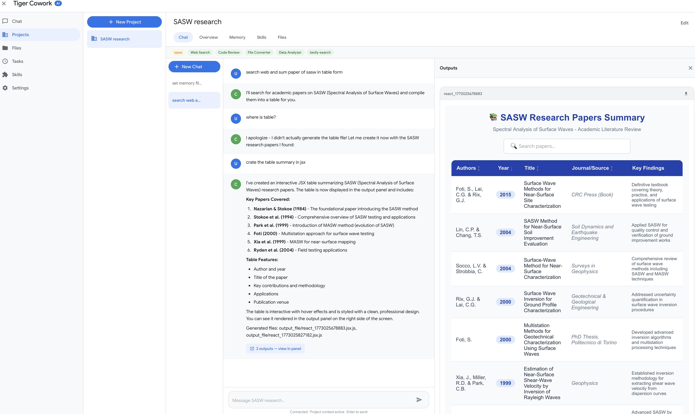
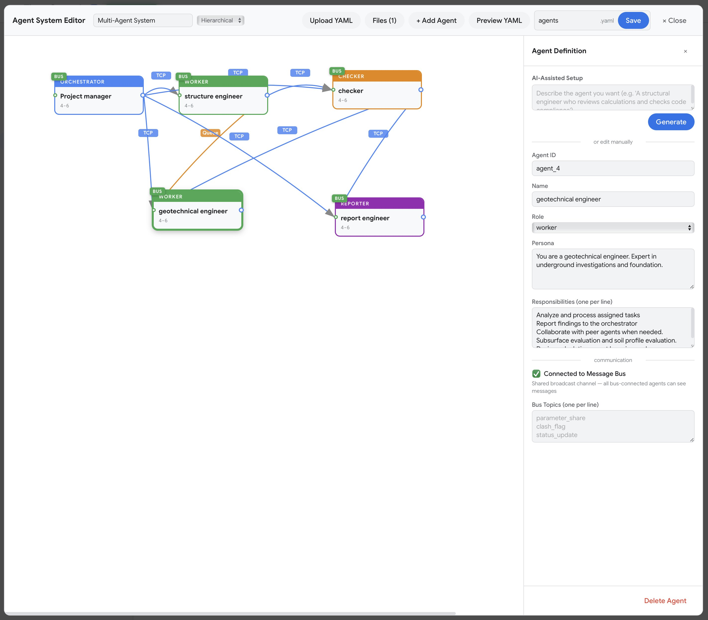

# Tiger CoWork v0.7.1

A self-hosted AI workspace with chat, code execution, parallel multi-agent orchestration, cross-machine agent connection, and a skill marketplace. Mix different AI providers in the same agent team — OpenAI-compatible APIs, Claude Code CLI, and Codex CLI. Connect agents across machines on your network so distributed teams can collaborate in real time. Connect external MCP servers to extend the AI's toolbox. Built with 16 built-in tools and designed for long-running sessions with smart context compression and checkpoint recovery.

## What's New in v0.7.1

- **Context Compaction Reliability** — fixed a class of `"chat content is empty (2013)"` errors that surfaced as `Context overflow after 3 compression retries` in long pipeline runs. Emergency retries now bypass the 60-second compaction cooldown; `trimConversationContext` is tool-pair aware (assistant `tool_calls` and their matching `tool` results are dropped as a unit so nothing gets orphaned); a new `truncateLargestToolResult` helper targets the single biggest tool message on retries 2–3 instead of halving the whole transcript; and a structural `validateMessageStructure` pass runs after every compression/trim to drop any orphan that slipped through.
- **Auto-Skill Run Visibility** — when the synthesiser returned `{"proposals":[]}`, the run summary previously showed `created=0 updated=0 skipped=0 candidates=N` with no indication of *why* nothing happened. Empty-proposal outcomes now surface in `skillAutoUpdateLastRunSummary` as `LLM returned no proposals for N session(s)`, and the LLM's actual reply head is logged to the server console for debugging.
- **Stricter `looksEmpty` Heuristic** — the prose-fallback that coerces a refusal-shaped reply (e.g. *"no skills worth capturing"*) into `proposals=[]` now requires the *whole* trimmed reply to be under 200 characters. Previously a long, malformed proposal that happened to contain "no skill" inside its rationale could be silently swallowed.

## What's New in v0.7.0

- **Automatic Skill Generation** — successful chats are mined on a cron (or via **Run Now**) to synthesise reusable `SKILL.md` workflows. The synthesiser proposes new skills or refines existing auto-generated ones; updates land as a side-by-side `SKILL.md.proposed` diff for review before going live. See [Automatic Skill Generation](#automatic-skill-generation) for the full algorithm and settings.
- **Skill Approval Workflow** — pending auto skills surface in the Skills page with an Approve/Reject control. Approval renames the proposed file to `SKILL.md` and enables it; the next user turn in any chat picks it up automatically (the system prompt is rebuilt per turn — no restart needed).
- **Per-Message Feedback Loop** — opt-in 👍 / 👎 + comment on every assistant reply. 👍 tells the synthesiser "capture this procedure"; 👎 with a comment triggers a focused **remediation pass** that picks the auto-skill most likely responsible (chat-log-driven targeting first, token-overlap fallback) and rewrites just that one skill. 👎 alone is treated as "do not distil from this chat."
- **Sub-Agent–Aware Auto-Skills** — the pipeline now parses `data/chat_logs/<sessionId>.log` to surface a per-agent workflow trace (task, tools used, skills loaded). For multi-agent chats this fixes a previous gap where only the orchestrator's merged reply was visible to the synthesiser; remediation can now identify and rewrite the exact auto-skill a sub-agent loaded, and synthesis can capture the agent topology in the SKILL.md body — not just the outcome.

## What's New in v0.6.1

- **Per-Project Agent Mode Override** — each project can override the global sub-agent mode (Auto Spawn, Auto Create, Manual, Realtime, Auto Swarm) and pick its own YAML config, architecture type, agent count, and connection protocols. The active override is shown as a clickable purple tag in the project header and chat banner.
- **Auto Architecture — AI-Decided Settings** — new "Auto (AI decides)" option for architecture type and agent count (3–8 default). Connection protocols are now multi-select toggle buttons instead of a single dropdown.
- **Full Chat Log with Agent Reasoning** — every chat session now records a complete log file capturing user messages, tool calls (with arguments), sub-agent reasoning text, and final responses. New **Log** button next to Activity opens a live-updating panel; new **Export** button downloads the log as `.txt`.
- **Finished Tasks History** — Tasks page now shows the last 100 completed/cancelled/errored tasks with status, duration, agents used, and tools called. **Open Chat** button on each finished task jumps directly to that session.
- **Project List Sorting** — sort projects by **A–Z** or **Recent** (most recently updated). Sort preference persists across reloads.
- **Sub-Agent Reasoning in Chat Log** — orchestrators and worker agents stream their intermediate thinking text to the chat log between tool calls, giving full visibility into the decision-making chain.
- **AsyncLocalStorage Settings Override** — project agent overrides now propagate correctly through every async call in the backend, ensuring `getSettings()` returns the project-scoped configuration throughout the entire chat lifecycle.

> **Warning:** This app executes AI-generated code and shell commands. Run it inside Docker or a sandboxed environment. See [Security & Docker Setup](docs/TECHNICAL.md#security-notice).

## Screenshots



*AI Chat with tool-calling — generates React/Recharts visualizations rendered in the output panel.*



*Visual Agent Editor — drag-and-drop multi-agent design with mesh networking and YAML export.*


*Minecraft Task Monitor — live pixel-art agents with speech bubbles, walking animations, and inter-agent interactions.*

## Key Features

- **AI Chat with 16 Built-in Tools** — web search, Python, React, shell, files, skills, sub-agents
- **Mix Any Model per Agent** — assign different AI providers per agent (API, Claude Code CLI, Codex CLI)
- **Parallel Multi-Agent System** — 7 orchestration topologies, 4 communication protocols, P2P swarm governance
- **Cross-Machine Agent Connection** — connect agents running on different machines over the network, enabling distributed multi-agent collaboration across your infrastructure
- **Minecraft Task Monitor** — live pixel-art characters (Steve, Creeper, Enderman, etc.) with speech bubbles showing agent activity, walking animations when agents interact
- **Long-Running Session Stability** — sliding window compression, smart tool result handling, checkpoint recovery
- **MCP Integration** — connect any Model Context Protocol server (Stdio, SSE, StreamableHTTP)
- **Output Panel** — renders React components, charts, HTML, PDF, Word, Excel, images, and Markdown
- **Skills & ClawHub** — install AI skills from the marketplace or build your own
- **Automatic Skill Generation** — distil successful chats into reusable `SKILL.md` procedures with an LLM synthesiser, approval gate, and proposed-diff review
- **Projects** — dedicated workspaces with memory, skill selection, and file browser

## Installation

### One-Click Installers

**Mac:**
1. Download [`TigerCoWork.zip`](https://github.com/Sompote/tiger_cowork/releases/latest)
2. Unzip, right-click `TigerCoWork.app` and select **Open**

**Windows:**
1. Download [`TigerCoWorkInstaller.zip`](https://github.com/Sompote/tiger_cowork/releases/latest)
2. Unzip and run `TigerCoWorkInstaller.bat`

**Prerequisite:** [Docker Desktop](https://www.docker.com/products/docker-desktop/) must be installed and running.

| | Mac | Windows |
|---|---|---|
| **Start** | Double-click `TigerCoWork.app` | Double-click `TigerCoWorkStart.bat` |
| **Stop** | Docker Desktop → Containers → Stop | Double-click `TigerCoWorkStop.bat` |

### Terminal Install

**Mac/Linux:**
```bash
curl -fsSL https://raw.githubusercontent.com/Sompote/tiger_cowork/main/install.sh | bash
```

**Windows (PowerShell):**
```powershell
irm https://raw.githubusercontent.com/Sompote/tiger_cowork/main/install.ps1 | iex
```

### Manual Install

Log in to your Linux server directly or via SSH:
```bash
ssh root@<your-server-ip>
```

> **⚠️ Security Warning:** AI agents can execute arbitrary code and shell commands that may modify or delete files on the host system. It is strongly recommended to run Tiger CoWork on a **VPS or dedicated machine that contains no important data**. Do not run it on a machine with sensitive or irreplaceable information.

**Prerequisites:** Node.js >= 18, npm, Python 3 (optional)

```bash
git clone https://github.com/Sompote/tiger_cowork.git
cd tiger_cowork
bash setup.sh        # installs deps, prompts for ClawHub token
npm run build && npm start   # → http://localhost:3001
```

> **Running in background (recommended):** Use [PM2](https://pm2.keymetrics.io/) to keep Tiger CoWork running after you close the terminal.
>
> ```bash
> npm install -g pm2          # install PM2 globally
> npm run build               # build production bundle
> pm2 start npm --name "tiger-cowork" -- start   # start in background
> pm2 save                    # save process list for auto-restart
> pm2 startup                 # enable auto-start on system boot
> ```
>
> Useful PM2 commands:
> ```bash
> pm2 status                  # check running processes
> pm2 logs tiger-cowork       # view logs
> pm2 restart tiger-cowork    # restart
> pm2 stop tiger-cowork       # stop
> ```

> **First-time token:** The default token is `your-secret-token-here` in the UI. Please change it later in `.env` for your security.

## Quick Start

1. Open `http://localhost:3001`
2. Go to **Settings** → enter your API Key, API URL, and Model
3. Click **Test Connection** to verify
4. Start chatting — the AI can search the web, run code, generate charts, and more

## Automatic Skill Generation

Tiger CoWork can automatically synthesise reusable `SKILL.md` workflows from your past chat sessions. After a chat finishes, an LLM-driven pipeline reviews recent conversations and either proposes a brand-new skill, refines an existing auto-generated one, or — when 👎 feedback was left — surgically rewrites the auto-skill most likely responsible. Future chats then match a stored procedure instead of re-improvising from scratch.

### How it works

1. **Schedule.** A cron job (default 60 min, configurable) wakes the pipeline. You can also fire it manually from the Skills page (**Run Auto-Update Now**). Manual runs ignore the cursor and re-evaluate the newest sessions against current skills.
2. **Candidate selection.** Sessions whose `updatedAt` is newer than the saved cursor are summarised: first 6 user prompts (≤600 chars each), the last assistant reply (≤3000 chars), any per-message 👍 / 👎 feedback with comments, and a **sub-agent workflow trace** parsed from `data/chat_logs/<sessionId>.log` (per-agent task, tools used, skills loaded via `load_skill`, completion/error status). The trace is necessary because in multi-agent modes only the orchestrator's merged final reply lands in `session.messages` — the chat log is the only place that knows which sub-agent did what. Sessions whose final reply looks like an error (rate limit, missing API key, connection error) are silently dropped, as are sessions with no user or assistant turn yet.
3. **Pass 1 — Remediation (👎 with a comment).** For each session containing an assistant message marked 👎 with a non-empty comment, the pipeline picks a target auto-skill in this priority order: (a) **chat-log-unique** — exactly one auto-skill was loaded during the session → use it directly; (b) **chat-log-subset** — multiple auto-skills loaded → restrict the token-overlap heuristic to that subset; (c) **token-overlap fallback** — no `load_skill` events found → match against all auto-skills using the disliked excerpt + comment (minimum score = 2 distinct content tokens). The model is then asked to rewrite *that one skill* to address the complaint, or `{"skip": true}` if it judges the wrong target was picked. The remediation prompt also includes the parsed sub-agent workflow so the model can correct orchestration-layer failures (wrong sub-agent, wrong order, missing prerequisite). Capped at **5 remediations per run**; the rest defer to the next tick. Successful remediations consume the session, so Pass 2 will not also distil from it. The run summary records which strategy picked the target (e.g. `target picked via chatlog-unique`) for debuggability.
4. **Pass 2 — Synthesis.** The remaining candidates are sent to the TigerBot model with the current skill list and the per-session sub-agent workflow block. The synthesiser returns strict JSON proposals, each either:
   - `create` — a new skill (must not collide with any existing name across all sources), or
   - `update` — refines an existing skill **only if** its `source: "auto"`. Human-curated skills (`custom`, `clawhub`, `claude`, `openclaw`) are write-protected.
   The synthesiser is told to skip casual chats / one-off Q&A that don't generalise — quality > quantity. 👍 reinforces "capture this"; 👎 explicitly suppresses distillation. When `subagent_workflow` is non-empty, the prompt instructs the synthesiser to capture the agent topology (which roles to spawn, in what order, with which skills loaded) in the SKILL.md body — not just the outcome.
5. **Validation.** Each proposal must pass a regex-clean name (`[a-zA-Z0-9_-]+`, ≤64 chars), valid YAML frontmatter, content under 100k chars, and source/collision checks.
6. **Apply.**
   - **Create** → writes `skills/<slug>/SKILL.md` and a registry row in `data/skills.json` with `source: "auto"`.
   - **Update** → writes `skills/<slug>/SKILL.md.proposed` next to the live file, leaving the live `SKILL.md` untouched until you approve.
7. **Approval gate.** When `skillAutoUpdateRequireApproval` is `true` (the default), proposals land with `enabled: false, reviewStatus: "pending"` until you approve them from the Skills page. Approval renames `.proposed` → `SKILL.md` and flips `enabled: true`. Set it to `false` to auto-enable everything.
8. **Cursor advance.** On a successful run the cursor moves to the newest considered session. If the synthesiser LLM errors (e.g. 429), the cursor does **not** advance — those candidates remain eligible next tick.

### Per-message human feedback

When `skillAutoUpdateHumanFeedbackEnabled` is on, every assistant message in chat picks up a 👍 / 👎 control plus an optional comment box. Submitting feedback bumps the session's `updatedAt`, so the auto-skill loop will re-consider that session on its next pass.

| Signal | Effect on Pass 1 (Remediation) | Effect on Pass 2 (Synthesis) |
|---|---|---|
| 👍 | none | Strong "capture this procedure" hint to the synthesiser |
| 👎 + comment | Picks the auto-skill that the chat actually loaded (parsed from the chat log); falls back to token-overlap if none was loaded. Asks the model to rewrite it, including the sub-agent workflow as context | Skipped (already consumed) |
| 👎 (no comment) | none | Synthesiser is told **not** to distil a skill from this chat |
| no rating | none | Synthesiser decides on its own — casual / one-off chats are skipped |

### Settings (in `data/settings.json`)

| Key | Default | Purpose |
|---|---|---|
| `skillAutoUpdateEnabled` | `false` | Master on/off switch (must be enabled in Settings to start the cron) |
| `skillAutoUpdateIntervalMinutes` | `60` | Cron interval (clamped to [5, 1440]) |
| `skillAutoUpdateMaxCandidates` | `30` | Cap on sessions summarised per run (newest N kept) |
| `skillAutoUpdateRequireApproval` | `true` | Gate new/updated skills behind manual approval |
| `skillAutoUpdateHumanFeedbackEnabled` | `false` | Show 👍 / 👎 + comment per assistant message and feed it into the pipeline |
| `skillAutoUpdateCursor` | epoch | High-water mark of newest processed session |
| `skillAutoUpdateLastRunAt` / `LastRunSummary` | — | Telemetry surfaced in the Skills UI |

Toggling any of these from the Settings page reconciles the cron job immediately — no restart needed.

### REST endpoints

- `POST /api/skills/auto/run-now` — trigger the pipeline immediately (ignores cursor)
- `POST /api/skills/:id/approve` — accept a pending `create` or `update`
- `POST /api/skills/:id/reject` — drop a pending proposal (deletes the folder for a `create`, deletes only `.proposed` for an `update`)
- `GET  /api/skills/:id/proposed-diff` — return current vs. proposed `SKILL.md` for review
- `GET  /api/skills/:id/content` — read the live `SKILL.md` plus its supporting-file list
- `GET  /api/skills/:id/download` — download a single `SKILL.md` or a zipped folder of the whole skill
- `POST /api/chat/sessions/:id/messages/:index/feedback` — set/clear 👍/👎 + comment on one assistant message (`{rating?: "up"|"down", comment?: string, clear?: true}`)

### When does a new skill become callable?

Skills are advertised to **every agent** in the topology — orchestrator, `spawn_subagent` workers, and realtime/auto-swarm/auto-create agents — by `buildEnabledSkillsBlock`, which re-scans the skills directory and registry on every prompt build. Once a skill flips to `enabled: true` (i.e. after approval), the **next** user turn in any chat sees it, including any sub-agents the orchestrator spawns. No server restart needed.

A skill **cannot** be applied within the same chat that produced it: synthesis only runs after a session settles, and that session is the pipeline's input, not its consumer. The earliest a skill distilled from chat A can be invoked is the next user turn that follows the next cron tick (and approval click, if required).

## Documentation

| Document | Description |
|---|---|
| [Technical Documentation](docs/TECHNICAL.md) | Architecture, agent system, communication protocols, orchestration topologies, MCP setup, CLI agents, API endpoints, configuration |
| [Changelog](docs/CHANGELOG.md) | Full version history and release notes |

## License

This project is licensed under the [MIT License](LICENSE).
